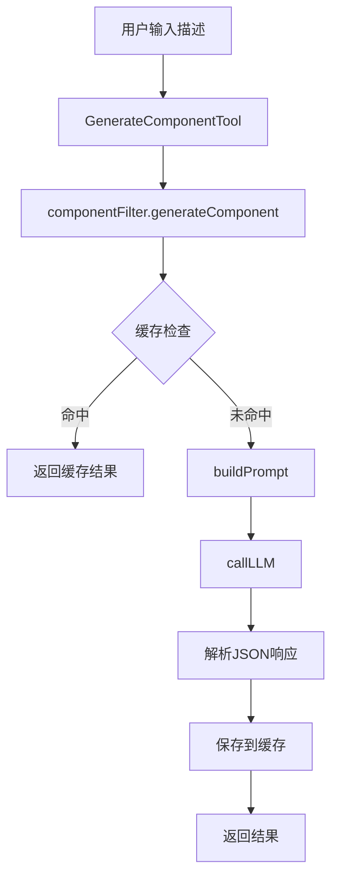

# Element Plus MCP 组件库核心流程文档

## 概述

Element Plus MCP 是一个基于 Model Context Protocol (MCP) 的 Element Plus 组件生成服务。通过集成大语言模型，实现根据用户描述自动生成 Element Plus Vue 组件的功能。

## 架构概览

```
用户请求
    ↓
MCP 工具层 (GenerateComponentTool)
    ↓
组件生成服务层 (componentFilter)
    ↓
提示构建层 (promptBuilder)
    ↓
LLM 服务层 (llmService)
    ↓
缓存服务层 (cacheService)
    ↓
数据层 (element-plus-components.json)
```

## 核心流程详解

### 1. 用户请求入口

用户通过以下方式发起组件生成请求：
- **MCP 工具调用**: 直接调用 `generate-component` 工具
- **HTTP API**: 通过 `/api/mcp/generate-component` 端点
- **IDE 集成**: 通过 `/ui` 命令在代码中生成

请求参数：
```typescript
{
  description: string;        // 组件需求描述
  componentType?: string;     // 组件类型提示 (可选)
  llmConfig?: LLMConfig;      // LLM 配置 (可选)
}
```

### 2. MCP 工具层 (GenerateComponentTool)

**文件**: `src/tools/generate-component-tool.ts`

**职责**:
- 继承 `BaseTool` 基类
- 定义工具 schema 和描述
- 调用组件生成服务
- 格式化返回结果

**核心方法**:
```typescript
async execute(params: {
  description: string;
  componentType?: string;
  llmConfig?: LLMConfig;
}): Promise<McpToolResult>
```

### 3. 组件生成服务层 (componentFilter)

**文件**: `src/services/componentFilter.ts`

**职责**:
- 处理组件生成的核心逻辑
- 管理缓存机制
- 调用 LLM 生成组件
- 解析和格式化 LLM 响应

**关键功能**:
- **关键词检测**: 对特定关键词（如"按钮"）提供硬编码响应
- **缓存机制**: 使用 `CacheService` 缓存生成结果
- **LLM 调用**: 通过 `llmService` 调用大语言模型
- **错误处理**: 多种 JSON 解析策略

### 4. 提示构建层 (promptBuilder)

**文件**: `src/utils/promptBuilder.ts`

**职责**:
- 根据用户需求构建 LLM 提示词
- 整合组件元数据信息
- 提供组件选择指导

**提示结构**:
```
用户需求：[用户描述]

以下是可用的 Element Plus 组件：
- ElButton: 按钮组件，用于触发用户操作
- ElTable: 表格组件，用于展示多条结构类似的数据
- ...

请根据需求选择最合适的组件，并输出：
{
  "component": "<组件名>",
  "reason": "<推荐理由>",
  "code": "<组件 Vue 示例代码>"
}
```

### 5. LLM 服务层 (llmService)

**文件**: `src/services/llmService.ts`

**职责**:
- 封装不同 LLM 提供商的调用逻辑
- 支持多种模型配置 (OpenAI, DeepSeek, Anthropic 等)
- 处理 API 密钥管理和错误处理

**支持的模型**:
- DeepSeek
- OpenAI
- Anthropic
- Gemini
- 自定义模型

### 6. 缓存服务层 (cacheService)

**文件**: `src/services/cacheService.ts`

**职责**:
- 提供基于 LRU 的缓存机制
- 减少重复的 LLM 调用
- 提高响应速度

**缓存配置**:
- 容量: 100 个结果
- 过期时间: 1 小时
- 键生成: 基于用户提示和配置的哈希

### 7. 数据层

**文件**:
- `src/data/components.json`: 简化组件列表（用于快速测试）
- `data/element-plus-components.json`: 完整组件元数据

**数据结构**:
```json
{
  "name": "ElTable",
  "description": "表格组件，用于展示多条结构类似的数据",
  "category": "数据展示",
  "props": [...],
  "events": [...],
  "slots": [...]
}
```

## 组件生成流程



## 关键特性

### 智能组件选择
- 基于用户描述自动匹配最合适的 Element Plus 组件
- 支持组件类型提示优化选择
- 提供选择理由说明

### 缓存优化
- 避免重复的 LLM 调用
- 提高响应速度
- 支持配置化缓存策略

### 多模型支持
- 支持主流 LLM 提供商
- 灵活的模型配置
- 统一的调用接口

### 错误处理
- 多层错误捕获和处理
- 友好的错误提示
- 降级策略支持

## 使用示例

### 基本使用
```javascript
// 通过 MCP 工具调用
const result = await generateComponentTool.execute({
  description: "生成一个显示用户列表的表格组件"
});
```

### 高级配置
```javascript
const result = await generateComponentTool.execute({
  description: "创建一个带有搜索和分页的表格",
  componentType: "table",
  llmConfig: {
    modelType: "deepseek",
    temperature: 0.7
  }
});
```

## 扩展和维护

### 添加新组件
1. 在 `element-plus-components.json` 中添加组件定义
2. 确保包含完整的 props、events、slots 信息
3. 测试组件生成效果

### 优化 LLM 提示
- 根据实际效果调整 `buildPrompt` 的提示词
- 添加更多组件使用指导
- 优化输出格式要求

### 性能优化
- 调整缓存策略
- 优化 LLM 调用参数
- 添加请求限流机制

## 故障排除

### 常见问题
1. **LLM 返回格式错误**: 检查 `componentFilter.ts` 的 JSON 解析逻辑
2. **组件选择不准确**: 优化 `promptBuilder.ts` 的提示词
3. **缓存失效**: 检查 `cacheService.ts` 的配置
4. **API 密钥问题**: 验证 LLM 服务配置

### 调试建议
- 查看控制台日志输出
- 检查缓存命中情况
- 验证 LLM 响应格式
- 测试不同模型效果
